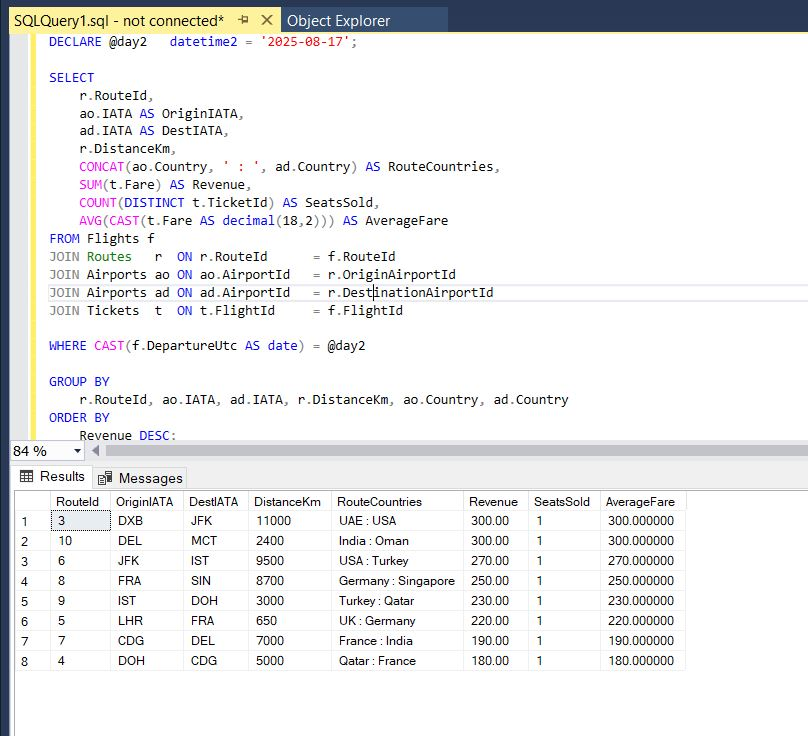
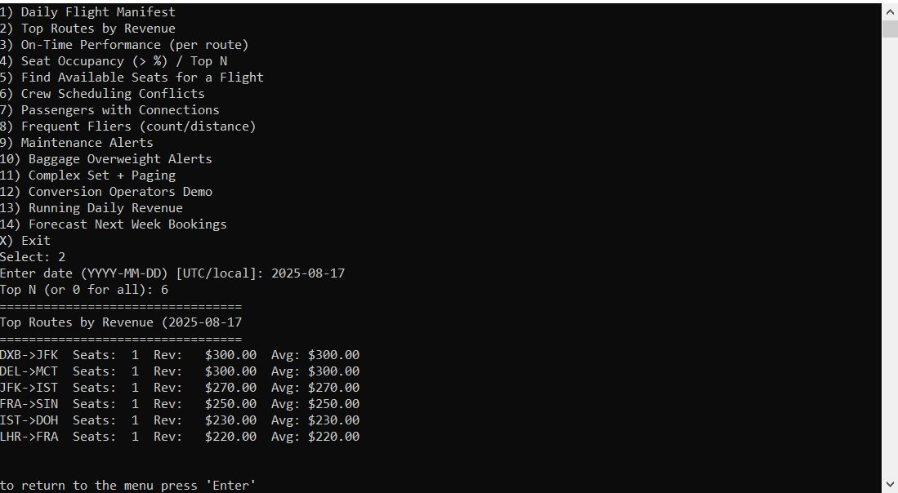
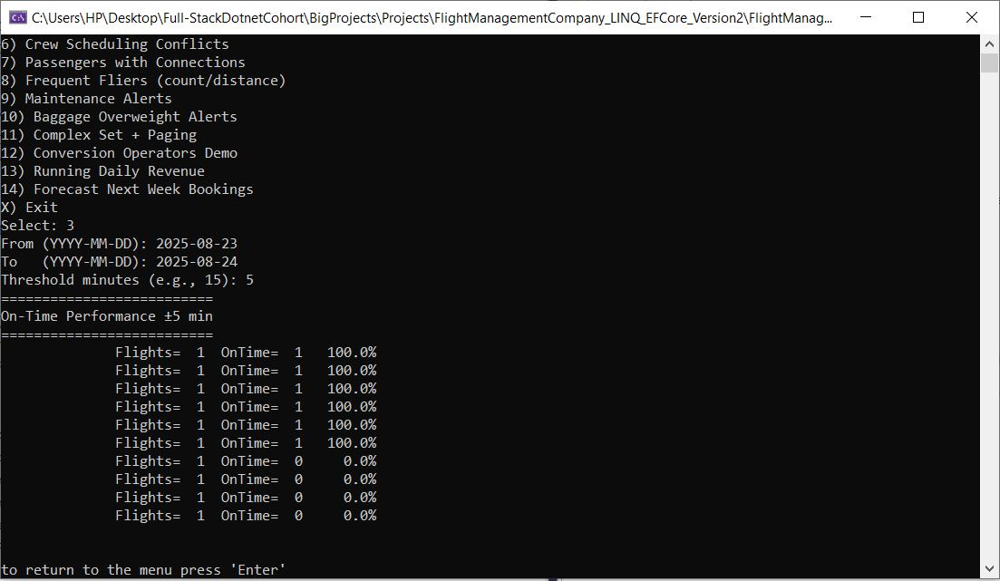

# FlightManagementCompany_LINQ_EFCore
# Project Summary 
Build a Flight Management System (FMS) backend for a company that manages flights, aircraft, crews, bookings, 
passengers and airports — implemented using layered architecture, EF Core, Repository pattern, and LINQ.

# Learning Goals 
- Design and document an ERD and relational schema. 
- Implement EF Core models with annotations and relationships. 
- Implement layered architecture: Presentation / Service / Repository / Data (DbContext). 
- Implement per-entity repositories exposing essential CRUD + query methods. 
- Write LINQ queries: joins, groupings, aggregations, partitioning, projection to DTOs, hierarchical queries

# Business Domain & ERD (entities + relationships)

### Entities (core): 

**Airport**

• AirportId (int PK)

• IATA (string, 3, unique)

• Name (string) 

• City (string) 

• Country (string) 

• TimeZone (string) 

**Aircraft**

• AircraftId (int PK) 

• TailNumber (string, unique) 

• Model (string) 

• Capacity (int) 

**CrewMember**

• CrewId (int PK) 

• FullName (string) 

• Role (enum/string) — Pilot/CoPilot/FlightAttendant 

• LicenseNo (string, nullable) 

**Route** 

• RouteId (int PK) 

• DistanceKm (int) 

**Flight** 

• FlightId (int PK) 

• FlightNumber (string) — e.g., "FM101" 

• DepartureUtc (DateTime) 

• ArrivalUtc (DateTime)

• Status (string/enum)

• Note: add unique constraint on (FlightNumber, DepartureUtc.Date) 

**Passenger** 

• PassengerId (int PK) 

• FullName (string) 

• PassportNo (string, unique) 

• Nationality (string) 

• DOB (DateTime) 

**Booking**

• BookingId (int PK) 

• BookingRef (string, unique) 

• BookingDate (DateTime) 

• Status (string) 

**Ticket** 

• TicketId (int PK) 

• SeatNumber (string) 

• Fare (decimal) 

• CheckedIn (bool) 

**FlightCrew ➔ relationship attributes on many to many** 

• RoleOnFlight (string) 

• Primary Key (FlightId, CrewId) 

**Baggage** 

• BaggageId (int PK) 

• TicketId (FK → Ticket) 

• WeightKg (decimal) 

• TagNumber (string) 

**AircraftMaintenance** 

• MaintenanceId (int PK) 

• MaintenanceDate (DateTime)

• Type (string) 

• Notes (string) 

# ERD


# Mapping


# Normlization
**Step 1 — First Normal Form (1NF)**
Becouse of the following reasons, the database is already in 1NF:
- Each table has a primary key.
- Each column contains atomic values.
- No repeating groups are visible.

**Step 2 — Second Normal Form (2NF)**
The database is already in 2NF because:
- All non-key attributes are fully functionally dependent on the primary key.
- There are no partial dependencies of any column on the primary key.
- All non-key attributes are dependent on the entire primary key.
- There are no transitive dependencies.

**Step 3 — Third Normal Form (3NF)**
The database is already in 3NF because:
- There are no transitive dependencies.
- All non-key attributes are dependent only on the primary key.

## Models

## Database Context with Fluent API

## Migration 


## Database Digram


## Models Repositeries

## Models Services

### Flight Analysis Service
**1. Daily Flight Manifest** 
- Input: date (local or UTC)
  
- Output DTO: FlightNumber, DepartureUtc, ArrivalUtc, OriginIATA, DestIATA, AircraftTail, 
PassengerCount, CrewList (names + roles), TotalBaggageWeight.
 
- Complexity: multiple joins, grouping, GroupJoin for crew.

***Sql query***
``` sql
Use FlightManagementDB;

-- 1. Daily Flight Manifest 
DECLARE @day   datetime2 = '2025-08-17';    -- day end in UTC (exclusive)


select 
	f.FlightNumber, 
	f.DepartureUtc, 
	f.ArrivalUtc, 
	ao.IATA as OriginIATA , 
	ad.IATA as DestIATA, 
	Aircraft.TailNumber, 
	count(DISTINCT p.PassengerId) as PassengerCount,  
	STRING_AGG( CONCAT(cm.Fname, ' ', cm.Lname, ' (', cm.Role, ')'), ', ') AS CrewList, 
	COALESCE(sum(bag.WeightKg),0) as TotalBaggageWeight
from Flights f join Routes r on r.RouteId = f.RouteId
join Airports  ao on ao.AirportId = r.OriginAirportId 
join Airports  ad on ad.AirportId = r.DestinationAirportId
join Aircraft on Aircraft.AircraftId = f.AircraftId
join Tickets t on f.FlightId = t.FlightId 
join Bookings b on  b.BookingId = t.BookingId
join Passengers p on p.PassengerId = b.PassengerId
join FlightCrews fc on f.FlightId = fc.FlightId
join CrewMembers cm on cm.CrewId = fc.CrewId
LEFT JOIN Baggages bag ON t.TicketId = bag.TicketId

WHERE CAST(f.DepartureUtc AS date) = @day

group by f.FlightNumber,
		f.DepartureUtc,
		f.ArrivalUtc,
		ao.IATA,
		ad.IATA,
		Aircraft.TailNumber

order by f.DepartureUtc


/* note :
- Use COUNT(DISTINCT p.PassengerId) to avoid double-counting a passenger with multiple tickets.
-Use COALESCE(SUM(bag.WeightKg), 0) to replace 0 in case null value 
- Not group by p.PassengerId becouse may there is one oassengers has multi tikets , group by use if there is unique value of ticket for every passengers id
- when has two elationship with two tables at sametime and want values for every relationship, this case of represent the relation ship is uncorrect :

join Airports on Airports.AirportId = r.OriginAirportId and Airports.AirportId = r.DestinationAirportId

insteaed of that should :

 join Airports  ao on ao.AirportId = r.OriginAirportId 
join Airports  ad on ad.AirportId = r.DestinationAirportId

SQL Server interprets '2025-08-17' as 2025-08-17 00:00:00 (midnight).
Most of DepartureUtc values ​​are given in hours and minutes (such as 09:30 or 14:10), so no journey is exactly midnight ⇒ the result is zero.
thus, 

Compare at the date level only
DECLARE @day date = '2025-08-17';

WHERE CAST(f.DepartureUtc AS date) = @day
*/  
```


***DTO***
```sql
public class FlightManifestDto
{
    public string FlightNumber { get; set; } = string.Empty;
    public string OriginIATA { get; set; } = string.Empty;      // IATA of origin
    public string DestinationIATA { get; set; } = string.Empty;      // IATA of destination
    public DateTime DepUtc { get; set; }
    public DateTime ArrUtc { get; set; }
    public string AircraftTail { get; set; } = string.Empty;
    public int PassengerCount { get; set; }
    public decimal TotalBaggageKg { get; set; }
    public List<CrewDto> Crew { get; set; } = new();

    
}
public class CrewDto
{
    public string Name { get; set; } = string.Empty; 
    public string Role { get; set; } = string.Empty; 
}
```

***C# query***
``` sql
public List<FlightManifestDto> DailyFlightManifest(DateTime dayUtcOrLocal)
{


    // 1.)Pre-filter flights to the day window to keep joins small
    var flightsOfDay = _flightRepo.GetAllFlights()
        .Where(f => f.DepartureUtc.Date == dayUtcOrLocal.Date);

    // 2) LINQ chain equivalent to your SQL
    var manifest =
        flightsOfDay
        // f + r
        .Join(_routeRepo.GetAllRoutes(),
              f => f.RouteId,
              r => r.RouteId,
              (f, r) => new { f, r })

        // + origin airport (ao)
        .Join(_airportRepo.GetAllAirports(),
              fr => fr.r.OriginAirportId,
              ao => ao.AirportId,
              (fr, ao) => new { fr.f, fr.r, ao })

        // + destination airport (ad)
        .Join(_airportRepo.GetAllAirports(),
              frao => frao.r.DestinationAirportId,
              ad => ad.AirportId,
              (frao, ad) => new { frao.f, frao.r, frao.ao, ad })

        // + aircraft
        .Join(_aircraftRepo.GetAllAircrafts(),
              frA => frA.f.AircraftId,
              ac => ac.AircraftId,
              (frA, ac) => new { frA.f, frA.r, frA.ao, frA.ad, ac })

        // + tickets
        .Join(_ticketRepo.GetAllTickets(),
              x => x.f.FlightId,
              t => t.FlightId,
              (x, t) => new { x.f, x.r, x.ao, x.ad, x.ac, t })

        // + bookings
        .Join(_bookingRepo.GetAllBookings(),
              xt => xt.t.BookingId,
              b => b.BookingId,
              (xt, b) => new { xt.f, xt.r, xt.ao, xt.ad, xt.ac, xt.t, b })

        // + passengers (for DISTINCT passenger count)
        .Join(_passengerRepo.GetAllPassengers(),
              xtb => xtb.b.PassengerId,
              p => p.PassengerId,
              (xtb, p) => new { xtb.f, xtb.r, xtb.ao, xtb.ad, xtb.ac, xtb.t, xtb.b, p })

        // + flight crew links
        .Join(_flightCrewRepo.GetAllFlightCrews(),
              x => x.f.FlightId,
              fc => fc.FlightId,
              (x, fc) => new { x.f, x.r, x.ao, x.ad, x.ac, x.t, x.b, x.p, fc })

        // + crew members
        .Join(_crewMemberRepo.GetAllCrewMembers(),
              xfc => xfc.fc.CrewId,
              cm => cm.CrewId,
              (xfc, cm) => new { xfc.f, xfc.r, xfc.ao, xfc.ad, xfc.ac, xfc.t, xfc.b, xfc.p, xfc.fc, cm })

        // LEFT JOIN Baggages
        .GroupJoin(_baggageRepo.GetAllBaggages(),
                   x => x.t.TicketId,
                   bag => bag.TicketId,
                   (x, bags) => new { x.f, x.r, x.ao, x.ad, x.ac, x.b, x.p, x.cm, x.fc, bags })

        // GROUP BY flight key (like your SQL GROUP BY)
        .GroupBy(x => new
        {
            x.f.FlightId,
            x.f.FlightNumber,
            x.f.DepartureUtc,
            x.f.ArrivalUtc,
            OriginIATA = x.ao.IATA,
            DestIATA = x.ad.IATA,
            x.ac.TailNumber
        })

        // Project to DTO
        .Select(g => new FlightManifestDto
        {
            FlightNumber = g.Key.FlightNumber,
            DepUtc = g.Key.DepartureUtc,
            ArrUtc = g.Key.ArrivalUtc,
            OriginIATA = g.Key.OriginIATA,
            DestinationIATA = g.Key.DestIATA,
            AircraftTail = g.Key.TailNumber,

            // DISTINCT passenger count
            PassengerCount = g.Select(x => x.p.PassengerId).Distinct().Count(),

            // SUM baggage weights (LEFT JOIN semantics)
            TotalBaggageKg = g.SelectMany(x => x.bags.DefaultIfEmpty())
                              .Sum(b => b == null ? 0 : b.WeightKg),

            // Crew list: DISTINCT by Name+Role then materialize to CrewDto
            Crew = g.Select(x => new { Name = $"{x.cm.Fname} {x.cm.Lname}", Role = x.cm.Role.ToString() })
                    .GroupBy(c => new { c.Name, c.Role })
                    .Select(cg => new CrewDto
                    {
                        Name = cg.Key.Name,
                        Role = cg.Key.Role
                    })
                    .ToList()
        })
        .OrderBy(m => m.DepUtc)
        .ToList();

    return manifest;
}

```


### 2.Top Routes by Revenue 
  
- For a date range, compute revenue per route (sum of ticket fares), ordered descending; include 
number of seats sold and average fare.
 
- Use GroupBy and projection.

***sql query***
```sql
DECLARE @day2   datetime2 = '2025-08-17';  

SELECT
    r.RouteId,
    ao.IATA AS OriginIATA,
    ad.IATA AS DestIATA,
    r.DistanceKm,
    CONCAT(ao.Country, ' : ', ad.Country) AS RouteCountries,
    SUM(t.Fare) AS Revenue,
    COUNT(DISTINCT t.TicketId) AS SeatsSold,
    AVG(CAST(t.Fare AS decimal(18,2))) AS AverageFare
FROM Flights f
JOIN Routes   r  ON r.RouteId      = f.RouteId
JOIN Airports ao ON ao.AirportId   = r.OriginAirportId
JOIN Airports ad ON ad.AirportId   = r.DestinationAirportId
JOIN Tickets  t  ON t.FlightId     = f.FlightId

WHERE CAST(f.DepartureUtc AS date) = @day2

GROUP BY
    r.RouteId, ao.IATA, ad.IATA, r.DistanceKm, ao.Country, ad.Country
ORDER BY
    Revenue DESC;  

```


***DTO***
```sql
public class RouteRevenueDto
{
    public int RouteId { get; set; }
    public string OriginIATA { get; set; } = string.Empty;      // Origin IATA
    public string DestinationIATA { get; set; } = string.Empty;      // Destination IATA
    public decimal Revenue { get; set; }                      // Sum of fares
    public decimal DistanceKm { get; set; }                     // Distance in kilometers
    public int SeatsSold { get; set; }                      // Count of tickets
    public string RouteCountries { get; set; } = string.Empty; // Comma-separated list of countries for the route
    public decimal AvgFare { get; set; }                      // Revenue / SeatsSold
}
```

***

***C# query***
```sql
public List<RouteRevenueDto> GetTopRoutesByRevenue(DateTime date, int topN)
{
    var flightsInRange = _flightRepo.GetAllFlights()
        .Where(f => f.DepartureUtc.Date >= date.Date);

    var query =
from f in flightsInRange
join r in _routeRepo.GetAllRoutes() on f.RouteId equals r.RouteId
join ao in _airportRepo.GetAllAirports() on r.OriginAirportId equals ao.AirportId
join ad in _airportRepo.GetAllAirports() on r.DestinationAirportId equals ad.AirportId
join t in _ticketRepo.GetAllTickets() on f.FlightId equals t.FlightId
select new
{
    r.RouteId,
    OriginIATA = ao.IATA,
    DestIATA = ad.IATA,
    ao.Country,
    DestCountry = ad.Country,
    r.DistanceKm,
    t.TicketId,
    t.Fare
};

    // 3) GroupBy route + projection to DTO
    var byRoute = query
        .GroupBy(x => new
        {
            x.RouteId,
            x.OriginIATA,
            x.DestIATA,
            x.Country,
            x.DestCountry,
            x.DistanceKm
        })
        .Select(g => new RouteRevenueDto
        {
            RouteId = g.Key.RouteId,
            OriginIATA = g.Key.OriginIATA,
            DestinationIATA = g.Key.DestIATA,
            DistanceKm = g.Key.DistanceKm,
            RouteCountries = g.Key.Country + " : " + g.Key.DestCountry,

            Revenue = g.Sum(x => x.Fare),
            // Seats sold = Number of tickets (Distinct for safety if duplicate join occurs)
            SeatsSold = g.Select(x => x.TicketId).Distinct().Count(), // projection part

            AvgFare = g.Average(x => x.Fare)
        })
        .OrderByDescending(x => x.Revenue)
        .Take(topN)
        .ToList();

    return byRoute;
}

```


### 3. On-Time Performance

***sql server query***
```sql
DECLARE @FromUtc datetime2 = '2025-08-23';
DECLARE @ToUtc   datetime2 = '2025-08-24';
DECLARE @ThresholdMinutes int = 5;

SELECT
    r.RouteId,
    ao.IATA AS OriginIATA,
    ad.IATA AS DestIATA,
    COUNT(*) AS Flights,
    SUM(CASE
            WHEN f.ActualArrivalUtc IS NOT NULL
             AND DATEDIFF(MINUTE, f.ArrivalUtc, f.ActualArrivalUtc) <= @ThresholdMinutes
            THEN 1 ELSE 0
        END) AS OnTime,
    CAST(
        SUM(CASE
                WHEN f.ActualArrivalUtc IS NOT NULL
                 AND DATEDIFF(MINUTE, f.ArrivalUtc, f.ActualArrivalUtc) <= @ThresholdMinutes
                THEN 1 ELSE 0
            END) * 100.0 / NULLIF(COUNT(*), 0)
        AS decimal(5,2)
    ) AS OnTimePercent
FROM Flights f
JOIN Routes   r  ON r.RouteId = f.RouteId
JOIN Airports ao ON ao.AirportId = r.OriginAirportId
JOIN Airports ad ON ad.AirportId = r.DestinationAirportId
WHERE f.DepartureUtc >= @FromUtc
  AND f.DepartureUtc <  @ToUtc
GROUP BY r.RouteId, ao.IATA, ad.IATA
ORDER BY OnTimePercent DESC;

```


***DTO***
```sql
 public class OnTimePerformanceDto
 {
     // Grouping key, e.g. "MCT->DXB" (per route) or any label you choose
     public string Key { get; set; } = string.Empty;

     // How many flights in the group
     public int Flights { get; set; }

     // How many were on time (within threshold minutes)
     public int OnTime { get; set; }

     // Convenience computed property
     public double OnTimePercent => Flights == 0 ? 0 : (OnTime * 100.0) / Flights;

     public RouteDto Route { get; set; } = new(); // Route information
 }
 public class RouteDto
 {
     public string OriginIATA { get; set; } = string.Empty;      // Origin IATA
     public string DestinationIATA { get; set; } = string.Empty;      // Destination IATA


 }
```

***C# Query***

```sql
ublic List<OnTimePerformanceDto> GetOnTimePerformanceByRoute(
    DateTime fromUtc, DateTime toUtc, int thresholdMinutes)
        {
            var flightsInRange = _flightRepo.GetAllFlights()
                .Where(f => f.DepartureUtc >= fromUtc && f.DepartureUtc < toUtc);

            var q =
                from f in flightsInRange
                join r in _routeRepo.GetAllRoutes() on f.RouteId equals r.RouteId
                join ao in _airportRepo.GetAllAirports() on r.OriginAirportId equals ao.AirportId
                join ad in _airportRepo.GetAllAirports() on r.DestinationAirportId equals ad.AirportId
                select new
                {
                    r.RouteId,
                    OriginIATA = ao.IATA,
                    DestIATA = ad.IATA,
                    ScheduledArrival = f.ArrivalUtc,        // المجدول
                    ActualArrival = f.ActualArrivalUtc   // الفعلي (nullable)
                };

            var result =
                q.GroupBy(x => new { x.RouteId, x.OriginIATA, x.DestIATA })
                 .Select(g =>
                 {
                     var flightsCount = g.Count();

                     var onTimeCount = g.Count(x =>
                         x.ActualArrival != null &&
                         (x.ActualArrival.Value - x.ScheduledArrival).TotalMinutes <= thresholdMinutes
                     );

                     return new OnTimePerformanceDto
                     {
                         Route = new RouteDto
                         {
                             OriginIATA = g.Key.OriginIATA,
                             DestinationIATA = g.Key.DestIATA
                         },
                         Flights = flightsCount,
                         OnTime = onTimeCount
                        
                     };
                 })
                 .OrderByDescending(x => x.OnTimePercent)  
                 .ToList();

            return result;
        }

```

